# Weltendämmerung

**Reverse Engineering a German 1980s C64 Strategy Game with AI**

What happens when you combine a 40-year-old Commodore 64 game and modern AI tools? This project documents the reverse engineering and web port of "Weltendämmerung" (Twilight of the Worlds), a fantasy strategy game by Dirk Maier.

### **Play:**
### [Web Port](https://s-macke.github.io/weltendaemmerung/)
### [Manual (English)](manual/manual.md)
### [Original (C64 Emulator)](https://www.commodoregames.net/Commodore64/Weltendammerung-8543.html)

## About the Game

Weltendämmerung is a turn-based fantasy strategy game for two players (Commanders). Players command asymmetric armies across an 80x40 tile map, taking turns through movement, attack, and fortification phases.

## How This Project Was Built

Twenty-five years ago, I started a similar reverse engineering project: [SAM](https://github.com/s-macke/SAM). Spread over half a year, it took several weeks just to understand the code and write a C port. 
This project? Three days. The difference was Claude Code and the remarkably capable Opus 4.5 model. Except for this README, everything else was written by AI.

Why this game? Weltendämmerung is pretty unknown for the AI, has a decent size, but significant complexity. According to the author Dirk Maier, it took [two months to develop](https://www.stcarchiv.de/happy-computer/1987/04/weltendaemmerung-auf).

The key to making this work was being spec-driven rather than just prompting. I kept all files small and removed unnecessary noise from time to time. CLAUDE.md stayed minimal but referenced all documentation. Instead of relying on chat history, I had the agent document everything in markdown files with clear separation of concerns. I kept sessions short enough to avoid context compaction. For complex tasks with high error potential, I performed explicit "check your assignment" verification. The chatbot can be sloppy, so catching issues early matters.

The total API cost came to $100 spread across more than 50 sessions.

The diagram below shows the spec-driven workflow. Starting from the original binary, each phase builds documentation that feeds the next—culminating in a web port implemented directly from the specification.

```mermaid
flowchart TD
    subgraph Phase1["Phase 1: Analysis"]
        A[("🎮 Original Binary<br/>weltendaemmerung.bin<br/>7129 bytes")] --> B["⚙️ Disassembly<br/>Flow analysis<br/>Code vs Data separation"]
    end

    subgraph Phase2["Phase 2: Reverse Engineering"]
        B --> C["📝 Annotated ASM<br/>Split into modules<br/>Variable naming"]
        B --> D["📊 Specification<br/>Memory layout<br/>Game mechanics"]

        %% Force C and D into the same row
        subgraph cd[" "]
            direction LR
            C
            D
        end
        style cd fill:transparent,stroke:transparent

        C -- "informs" --> D
        D -- "refines" --> C
        C & D --> E["📖 docs/*.md<br/>Movement, Attack<br/>Units, Map, etc."]
    end

    subgraph Phase3["Phase 3: Porting"]
        E --> F["📋 PORTING.md<br/>Design document<br/>Implementation plan"]
        F --> G["🔨 Implementation<br/>Step-by-step<br/>following spec"]
        G --> H[("🌐 Web Port<br/>TypeScript + Vite<br/>Playable in browser")]
    end

    style A fill:#4a5568,stroke:#718096
    style H fill:#48bb78,stroke:#38a169
```

## Binary Analysis

It started with the raw binary [weltendaemmerung.bin](disassembly/archive/weltendaemmerung.bin)—just 7129 bytes—and a simple prompt:

> `Analyze the binary file weltendaemmerung.bin and write a short summary in CLAUDE.md`

As always, the model wrote way too much, but I ended with a [decent description of the game](https://github.com/s-macke/weltendaemmerung/commit/fe9ec7bfdad97dc4bee9049b26825832106bdcc4). The `strings` and `xxd` shell commands were particularly useful for helping the chatbot understand the binary structure. See [strings.txt](disassembly/archive/strings.txt) and [xxd.txt](disassembly/archive/xxd.txt) for the raw output.

### Disassembly

Next came the disassembler:

> `Write a C64 disassembler for the weltendaemmerung.bin file in Python. Put it into the "tools" directory. Make a flow analysis, so that you can differ between code and data. Show the binary parts like in a hex editor. Reference the disassembled file in CLAUDE.md`

The model checked for standard 6502 CPU disassemblers but couldn't find any on my system, so it wrote its own custom [disassembler](tools/c64_disasm.py). The tool uses flow analysis to separate code from data, tracing execution paths from entry points and classifying bytes based on control flow rather than linear scanning. The result: [weltendaemmerung.asm](disassembly/archive/weltendaemmerung.asm).

At 2700 lines, the disassembly was too large for the chatbot's context window. I had it split the file:

> `Split the weltendaemmerung.asm file into multiple smaller files, which are then referenced inside Claude.md. All file names should start with the start and end address and a short description and put in the directory disassembly. Figure out the technical as well as functional parts of the asm file first.`

This produced a dozen .asm files. Some descriptions were wrong, but that was not the main goal.

### Reverse Engineering

With the disassembled code split into modules, the reverse engineering proceeded through several phases. I maintained tight documentation throughout. Both formal [specs](docs/) of assembly elements and inline annotations as new insights emerged.

#### Memory Layout & Variables

> `Check all assembler files and figure out the memory layout used. Then write a markdown file.`

The memory layout was extracted from the assembler files into [docs/memory_layout.md](docs/memory_layout.md). Game state variables were documented in [docs/variables.md](docs/variables.md), and the assembler files were annotated with variable comments. This required several iterations.

#### Tile & Map Extraction

> `Extract the tiles used in this game and store these tiles in the assets folder.`

The 38 character tiles were extracted to `assets/tiles/`. Initial extraction produced all-gray tiles - the model didn't account for C64's context-dependent coloring. After prompting about map screen colors and correlating terrain types with tiles, the colors were corrected. Terrain types were documented in [docs/map.md](docs/map.md).

> `I am 100% sure, that tile_13.png is not forest. Forest is tile_14.png.`

Color mapping required manual verification - the model initially misidentified forest tiles.

#### Unit System

> `Look at map.md and determine the initial placing of units of the map.`

Unit placements were documented in [docs/units.md](docs/units.md). The model initially used "TOWN" terminology which had to be corrected to "gates" - there are no towns in the game.

#### Game Phases

Each game phase required dedicated analysis sessions:

> `Analyze the movement phase and write a movement.md document.`

- **Movement**: [docs/movement.md](docs/movement.md) - terrain costs, unit-specific movement tables, Mermaid state diagrams
- **Attack**: [docs/attack.md](docs/attack.md) - combat formulas, range system, catapult special logic
- **Fortification**: [docs/torphase.md](docs/torphase.md) - gate mechanics, 13 gate positions

#### C64-Specific Techniques

The reverse engineering also uncovered classic 6502 optimization techniques:

**BCD Arithmetic**: All unit statistics (defense, movement points, attack values) and the turn counter use Binary Coded Decimal format. The 6502's decimal mode (`SED`/`CLD`) makes BCD arithmetic automatic. The Catapult's range of 12 required special handling - BCD `$12` needed conversion to binary `$0C` for Euclidean distance comparison.

**Self-Modifying Code**: The game modifies its own instructions at runtime:
- Screen fill routines increment address bytes directly in the code
- Sound effects cycle through ROM addresses by modifying the `LDA` operand
- Attack modifier uses KERNAL ROM bytes as pseudo-random source, incrementing the address after each read

These techniques don't translate to JavaScript - the port uses regular arithmetic and standard random functions.

#### Additional Systems

- [docs/save_format.md](docs/save_format.md) - Save game file format
- [docs/program_flow.md](docs/program_flow.md) - Turn structure, state machine, cursor handling
- [docs/title_screen.md](docs/title_screen.md) - Startup sequence, menu system
- [docs/screen_display.md](docs/screen_display.md) - Screen layout, phase-specific display

### Web Port

For the port, I choose a CLAUDE.md file and I enabled several Claude Code plugins: **Playwright** for UI testing via Chrome, **frontend-design** for building a retro-modern aesthetic, and **typescript-lsp** for code analysis (though I never saw it activate).

With documentation complete, the web port followed the same spec-driven approach:

> `Port this game to a web application`
> * `Technology: vite, typescript and tailwind.`
> * `Do not use BCD format.`
> * `No sound`
> * `No load and store`
> * `Don't skip the title screen`
> * `For the map and the units use the C64 colors and tiles.`
> * `Mouse control. Use different mouse pointers if possible. (See sprite/cursor handling)`
> * `Implement the exact rulebook.`
> * `The visuals can be more modern with retro style. But don't skip any information such as terrain data or unit stats.`
> * `Phase/player change over a end-turn button.`
> * `Read the full documentation first.`
> * `Language is english. Translate every German word to English.`
> * `Write a porting markdown file, with a design and an implementation plan.`
> * `Reference the documentation files in the markdown file when necessary.`

The agent read all documentation files before generating [PORTING.md](PORTING.md) with a comprehensive design document.

From here, things got messier. I had the model implement each step from the porting guide across several parallel sessions. Documentation bugs surfaced along the way, which the chatbot fixed once I pointed them out. 
The web port code is not pretty. But it works, and it's a good candidate for refactoring experiments with future models.

> `Use the frontend design skill to design a nice retro-modern look for the webapp.`

The UI was polished using Claude Code's frontend design skill for the final retro-modern appearance.

## Conclusion

This repository probably won’t age well. It’s a snapshot, a record of winter 2025/26, when coding agents became strong enough to really deserve the word agentic. If you extrapolate the pace of progress, this entire project may be doable with a single well-crafted prompt by the end of 2026, for maybe $10.

The chatbot already knows a lot about vintage computers and usually behaves like a professional programmer. But it can also be sloppy, and it doesn’t always recognize its own uncertainty. One example: a variable that was reused once as a number and once as a flag. The chatbot couldn’t infer that, even after several attempts. I had to tell it explicitly.
Working with a coding agent is often two steps forward, one step back, and one step sideways.

So the human role shifts toward orchestrating intelligence, defining goals, verification and course correction. You need enough domain knowledge to notice when the AI is wrong, and enough patience to keep checking. A spec-driven approach helps. When everything is written down, errors become easier to spot. When sessions stay short, context stays fresh. When you force the AI to re-check what it produced, it catches mistakes it would otherwise miss.
