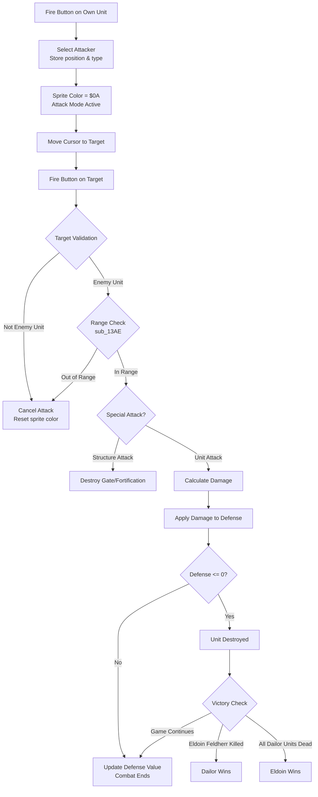

# Weltendaemmerung Attack Phase (Angriffsphase)

This document describes the attack phase mechanics, combat formulas, and damage calculation.

## Overview

The Attack Phase (Angriffsphase) is Phase 1 of each round. During this phase, units can engage in combat while having restricted movement (1 movement point only).

**Phase Behavior:**

| Phase | Name                      | Movement Points  | Combat    |
|-------|---------------------------|------------------|-----------|
| 0     | Bewegungsphase (Movement) | Full B value     | Disabled  |
| 1     | Angriffsphase (Attack)    | Restricted to 1  | Enabled   |
| 2     | Torphase (Fortification)  | No movement      | Disabled  |

## Combat Flow



## Initiating an Attack (sub_12EE)

When the fire button is pressed on an owned unit during attack phase:

1. **Sprite Color Check**: If sprite color is not $FA (attack mode), enter attack mode
2. **Unit Ownership Validation** (`sub_12D4`): Verify the unit belongs to current player
3. **Store Attack Context**:
   - `$0355` (ATTACK_SRC_X): Attacker's X coordinate
   - `$0356` (ATTACK_SRC_Y): Attacker's Y coordinate
   - `$0358-$0359` (ATTACKER_PTR): Pointer to attacker's unit record
   - `$0357` (ATTACKER_TYPE): Attacker's unit type (0-15)

```assembly
; Attack mode activation
    LDA #$0A
    STA VIC_SP0COL          ; Set sprite to attack color
    LDA $034B               ; CURSOR_MAP_X
    STA $0355               ; Store as attack source X
    LDA $034C               ; CURSOR_MAP_Y
    STA $0356               ; Store as attack source Y
```

## Range Calculation (sub_13AE)

The game uses **Euclidean distance** to determine if a target is within attack range.

### Distance Formula

```
distance = sqrt((src_x - dest_x)² + (src_y - dest_y)²)
```

### Implementation Details

The range check uses BASIC ROM floating-point routines:

| ROM Address | Function                    |
|-------------|-----------------------------|
| $BC3C       | Convert signed byte to FAC  |
| $BC0C       | Absolute value              |
| $BA2B       | Square the value            |
| $BBCA       | Store FAC to memory         |
| $BA8C       | Add two floats              |
| $B86A       | Move memory to FAC          |
| $BF71       | Square root                 |
| $BC9B       | Convert FAC to integer      |

### Range Values by Unit Type

| Unit Type | German        | English        | Range (R) |
|-----------|---------------|----------------|-----------|
| 0         | Schwertträger | Sword Bearers  | 1         |
| 1         | Bogenschützen | Archers        | 8         |
| 2         | Adler         | Eagle          | 2         |
| 3         | Lanzenträger  | Spear Bearers  | 2         |
| 4         | Kriegsschiff  | Warship        | 8         |
| 5         | Reiterei      | Cavalry        | 5         |
| 6         | Feldherr      | Commander (E)  | 1         |
| 7         | Bogenschützen | Archers        | 8         |
| 8         | Katapult      | Catapult       | 12        |
| 9         | Blutsauger    | Bloodsucker    | 1         |
| 10        | Axtmänner     | Axe Men        | 1         |
| 11        | Feldherr      | Commander (D)  | 1         |
| 12        | Lindwurm      | Dragon/Wyrm    | 2         |
| 13        | Rammbock      | Battering Ram  | 1         |
| 14        | Wagenfahrer   | Wagon Drivers  | 7         |
| 15        | Wolfsreiter   | Wolf Riders    | 3         |

**BCD Conversion Note**: The Catapult's range is stored as BCD $12 (decimal 12). Since the Euclidean distance calculation returns a binary integer, the code converts BCD $12 to binary $0C (both represent 12) for correct comparison. Other range values (1-8) are identical in BCD and binary, so no conversion is needed.

## Damage Calculation

Combat damage uses **BCD (Binary Coded Decimal)** arithmetic throughout.

### Base Attack Values

| Unit Type | German        | English        | Attack (A) |
|-----------|---------------|----------------|------------|
| 0         | Schwertträger | Sword Bearers  | 4          |
| 1         | Bogenschützen | Archers        | 5          |
| 2         | Adler         | Eagle          | 7          |
| 3         | Lanzenträger  | Spear Bearers  | 5          |
| 4         | Kriegsschiff  | Warship        | 20         |
| 5         | Reiterei      | Cavalry        | 6          |
| 6         | Feldherr      | Commander (E)  | 6          |
| 7         | Bogenschützen | Archers        | 5          |
| 8         | Katapult      | Catapult       | 1          |
| 9         | Blutsauger    | Bloodsucker    | 8          |
| 10        | Axtmänner     | Axe Men        | 4          |
| 11        | Feldherr      | Commander (D)  | 6          |
| 12        | Lindwurm      | Dragon/Wyrm    | 30         |
| 13        | Rammbock      | Battering Ram  | 1          |
| 14        | Wagenfahrer   | Wagon Drivers  | 10         |
| 15        | Wolfsreiter   | Wolf Riders    | 8          |

### Combat Modifier (sub_1567)

A pseudo-random modifier is added to the base attack value:

```assembly
sub_1567:
    PHA
    LDA $E000           ; Read byte from KERNAL ROM (address self-modifies)
    AND #$07            ; Mask to 0-7
    INC $1569           ; Increment ROM address for next call
    TAX
    PLA
    CLC
    SED                 ; Enable BCD mode
    ADC $1579,X         ; Add modifier from table
    CLD
    RTS

; Modifier table (indexed by ROM_byte & 7):
    .byte $00, $01, $01, $02, $02, $03, $03, $04
```

**Modifier Distribution:**
- 0: 12.5% chance (index 0)
- 1: 25% chance (indices 1, 2)
- 2: 25% chance (indices 3, 4)
- 3: 25% chance (indices 5, 6)
- 4: 12.5% chance (index 7)

**Average modifier**: 2.0

### Damage Formula

```
Final Damage = Base Attack + Random Modifier (0-4)
```

### Defense Reduction

```assembly
    LDY #$02
    LDA ($F9),Y         ; Load defender's defense (unit[2])
    SED                 ; Enable BCD mode
    SEC
    SBC $035C           ; Subtract damage
    CLD                 ; Disable BCD mode
    BEQ unit_destroyed  ; If result = 0, destroyed
    CMP #$5A            ; Check for BCD underflow
    BCS unit_destroyed  ; If underflow, destroyed
    STA ($F9),Y         ; Store reduced defense
```

**Unit Destruction Conditions:**
- Defense reduced to exactly 0
- Defense underflows (BCD result >= $5A indicates negative)

## Defense Values

| Unit Type | German        | English        | Defense (V) |
|-----------|---------------|----------------|-------------|
| 0         | Schwertträger | Sword Bearers  | 16          |
| 1         | Bogenschützen | Archers        | 12          |
| 2         | Adler         | Eagle          | 11          |
| 3         | Lanzenträger  | Spear Bearers  | 14          |
| 4         | Kriegsschiff  | Warship        | 18          |
| 5         | Reiterei      | Cavalry        | 10          |
| 6         | Feldherr      | Commander (E)  | 16          |
| 7         | Bogenschützen | Archers        | 12          |
| 8         | Katapult      | Catapult       | 5           |
| 9         | Blutsauger    | Bloodsucker    | 10          |
| 10        | Axtmänner     | Axe Men        | 16          |
| 11        | Feldherr      | Commander (D)  | 16          |
| 12        | Lindwurm      | Dragon/Wyrm    | 30          |
| 13        | Rammbock      | Battering Ram  | 5           |
| 14        | Wagenfahrer   | Wagon Drivers  | 16          |
| 15        | Wolfsreiter   | Wolf Riders    | 18          |

## Special Unit Abilities

### Structure Attackers

Only 3 units can attack and destroy structures:

| Unit Type | ATTACKER_TYPE | Can Destroy |
|-----------|---------------|-------------|
| Katapult  | $08 (type 8)  | Gates + Walls |
| Lindwurm  | $0C (type 12) | Gates + Walls |
| Rammbock  | $0D (type 13) | Gates only |

**Note:** Adler (type 2, ATTACKER_TYPE $02) cannot destroy structures despite being a flying unit.

**Structure targets:**
- Index $06 = Gate (Tor, char $6F) - decrements gate counter, replaced with pavement
- Index $09 = Wall (Mauer, char $72) - destroyed directly, replaced with pavement

When these units attack a structure:
1. For gates: Gate counter at `$4FF2,X` is decremented (disables torphase at that position)
2. Structure is replaced with pavement ($71)
3. No combat damage calculation occurs

### Unit Type Checks

```assembly
L1328:
    LDA $0357           ; Attacker type
    CMP #$08            ; Katapult?
    BEQ structure_attack ; -> can destroy gates + walls
    CMP #$0C            ; Lindwurm?
    BEQ structure_attack ; -> can destroy gates + walls
    CMP #$0D            ; Rammbock?
    BEQ gate_attack     ; -> gates only, not walls
```

## Unit Destruction (L13FD)

When a unit is destroyed:

```assembly
L13FD:
    JSR sub_20FB        ; Play destruction sound
    LDA #$FF
    LDY #$01
    STA ($F9),Y         ; Mark unit as dead (Y coord = $FF)
    LDY #$05
    LDA ($F9),Y         ; Get original terrain
    PHA
    JSR sub_2197        ; Check victory conditions
```

### Map Update

1. Original terrain (stored in unit[5]) is restored to map
2. Screen character and color RAM updated
3. Unit record marked with $FF in Y coordinate

## Key Memory Addresses

### Variables

| Address     | Name               | Description                        |
|-------------|--------------------|------------------------------------|
| $0347       | CURRENT_PLAYER     | Active player (0=Eldoin, 1=Dailor) |
| $034A       | GAME_STATE         | Current phase (0, 1, 2)            |
| $034B       | CURSOR_MAP_X       | Cursor X position                  |
| $034C       | CURSOR_MAP_Y       | Cursor Y position                  |
| $034F       | ACTION_UNIT        | Unit type at cursor ($0B-$1A)      |
| $0355       | ATTACK_SRC_X       | Attacker's X coordinate            |
| $0356       | ATTACK_SRC_Y       | Attacker's Y coordinate            |
| $0357       | ATTACKER_TYPE      | Attacker's unit type (0-15)        |
| $0358-$0359 | ATTACKER_PTR       | Pointer to attacker unit record    |
| $035C       | SAVE_LETTER        | Calculated damage value            |
| $4FF0       | STATE_DAILOR_UNITS | Count of Dailor units remaining    |
| $4FF2       | STATE_GATE_FLAGS   | Gate/fortification counters        |

### Data Tables

| Address | Size | Description |
|---------|------|-------------|
| $1017 | 16 | V (Defense) values per unit type |
| $1027 | 16 | R (Range) values per unit type |
| $1037 | 16 | B (Movement) values per unit type |
| $1047 | 16 | A (Attack) values per unit type |
| $1579 | 8  | Combat modifier table [0,1,1,2,2,3,3,4] |

### Routines

| Address | Name | Purpose |
|---------|------|---------|
| $12B1 | sub_12B1 | Combat system entry point |
| $12C0 | sub_12C0 | Idle unit animation |
| $12D4 | sub_12D4 | Check unit ownership |
| $12EE | sub_12EE | Initiate attack / process target |
| $1328 | L1328 | Execute attack after range check |
| $1373 | L1373 | Calculate and apply damage |
| $13AE | sub_13AE | Range calculation (Euclidean distance) |
| $13FD | L13FD | Handle unit destruction |
| $1445 | sub_1445 | Clear attacker's attack state |
| $1456 | loc_1456 | Victory screen display |
| $1567 | sub_1567 | Add combat modifier |
| $2197 | sub_2197 | Check victory conditions |
