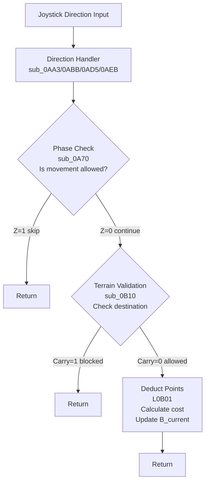

# Weltendaemmerung Movement System

This document describes the movement phase mechanics, terrain costs, and related algorithms.

## Overview

Movement Phase (Bewegungsphase) is Phase 0 of each round. During this phase, units can move using their full movement point allocation. Movement is controlled by joystick input and validated against terrain and unit position.

**Phase Behavior:**

| Phase | Name                      | Movement Points  |
|-------|---------------------------|------------------|
| 0     | Bewegungsphase (Movement) | Full B value     |
| 1     | Angriffsphase (Attack)    | Restricted to 1  |
| 2     | Torphase (Fortification)  | No movement      |

## Movement Points System

### Unit Record Structure

Each unit stores movement data in its 6-byte record at `$5FA0`:

| Offset | Field     | Description                      |
|--------|-----------|----------------------------------|
| 0      | X         | X coordinate (0-79)              |
| 1      | Y         | Y coordinate (0-39)              |
| 2      | V         | Defense (can decrease in combat) |
| 3      | B_current | Current movement points (BCD)    |
| 4      | B_max     | Maximum movement points (BCD)    |
| 5      | terrain   | Original terrain under unit      |

### BCD Encoding

All movement point values use **Binary Coded Decimal (BCD)** encoding. The 6502 decimal mode (`SED`/`CLD`) is used for arithmetic operations.

### Unit Movement Values

| Unit Type | German        | English            | B (Movement)  |
|-----------|---------------|--------------------|---------------|
| 0         | Schwertträger | Sword Bearers      | 10            |
| 1         | Bogenschützen | Archers            | 10            |
| 2         | Adler         | Eagle              | 12            |
| 3         | Lanzenträger  | Spear Bearers      | 10            |
| 4         | Kriegsschiff  | Warship            | 8             |
| 5         | Reiterei      | Cavalry            | 15            |
| 6         | Feldherr      | Commander (Eldoin) | 10            |
| 7         | Bogenschützen | Archers            | 10            |
| 8         | Katapult      | Catapult           | 9             |
| 9         | Blutsauger    | Bloodsucker        | 12            |
| 10        | Axtmänner     | Axe Men            | 10            |
| 11        | Feldherr      | Commander (Dailor) | 10            |
| 12        | Lindwurm      | Dragon/Wyrm        | 10            |
| 13        | Rammbock      | Battering Ram      | 10            |
| 14        | Wagenfahrer   | Wagon Drivers      | 14            |
| 15        | Wolfsreiter   | Wolf Riders        | 12            |

## Terrain Movement Costs

### Base Terrain Costs

Most terrain costs **1 movement point** per tile. Special terrain has unit-specific costs:

| Char  | German   | English   | Cost           |
|-------|----------|-----------|----------------|
| $69   | Wiese    | Meadow    | 1              |
| $6A   | Wiese    | Meadow    | 1 (variant 2)  |
| $6B   | Fluss    | River     | Variable       |
| $6C   | Wald     | Forest    | Variable       |
| $6D   | Ende     | End-marker| 1              |
| $6E   | Sumpf    | Swamp     | Variable       |
| $6F   | Tor      | Gate      | 1              |
| $70   | Gebirge  | Mountains | 1              |
| $71   | Pflaster | Pavement  | 1              |
| $72   | Mauer    | Wall      | 1              |
| $73   | Mauer    | Wall      | 1              |

### Unit-Specific Cost Tables

Three terrain types have per-unit cost tables stored at fixed addresses:

**River Costs ($0BC3) - terrain $6B:**
```
Index: 0  1  2  3  4  5  6  7  8  9  10 11 12 13 14 15
Cost:  4  4  1  4  1  4  4  2  4  1  2  2  4  4  5  2
```

**Forest Costs ($0BD3) - terrain $6C:**
```
Index: 0  1  2  3  4  5  6  7  8  9  10 11 12 13 14 15
Cost:  2  2  1  3  0  4  2  2  4  1  2  2  1  3  7  2
```

**Swamp Costs ($0BE3) - terrain $6E:**
```
Index: 0  1  2  3  4  5  6  7  8  9  10 11 12 13 14 15
Cost:  3  3  1  3  0  4  3  3  4  1  3  3  1  4  7  4
```

### Unit Cost Summary

| Unit          | Type  | River   | Forest | Swamp |
|---------------|-------|---------|--------|-------|
| Sword Bearers | 0     | 4       | 2      | 3     |
| Archers (E)   | 1     | 4       | 2      | 3     |
| Eagle         | 2     | 1       | 1      | 1     |
| Spear Bearers | 3     | 4       | 3      | 3     |
| Warship       | 4     | 1       | N/A    | N/A   |
| Cavalry       | 5     | 4       | 4      | 4     |
| Commander (E) | 6     | 4       | 2      | 3     |
| Archers (D)   | 7     | 2       | 2      | 3     |
| Catapult      | 8     | 4       | 4      | 4     |
| Bloodsucker   | 9     | 1       | 1      | 1     |
| Axe Men       | 10    | 2       | 2      | 3     |
| Commander (D) | 11    | 2       | 2      | 3     |
| Dragon/Wyrm   | 12    | 4       | 1      | 1     |
| Battering Ram | 13    | 4       | 3      | 4     |
| Wagon Drivers | 14    | 5       | 7      | 7     |
| Wolf Riders   | 15    | 2       | 2      | 4     |

**Notable Movement Abilities:**
- **Eagle & Bloodsucker**: Low cost (1) for all special terrains - fly/pass through easily
- **Warship**: Water-only unit - can ONLY move on river terrain ($6B). Cannot enter forest, swamp, mountains, or land. The "0" values in cost tables are unused placeholders.
- **Wagon Drivers**: High forest/swamp cost (7) - slow through difficult terrain

## Movement Validation

### Phase Check (sub_0A70)

Before any movement, the current phase is checked:

```assembly
sub_0A70:
    LDA $034A           ; GAME_STATE (phase)
    CMP #$01            ; Angriffsphase?
    BEQ skip            ; Z=1: skip full movement
    CMP #$02            ; Torphase?
    BEQ skip            ; Z=1: skip full movement
    ; Phase 0: check sprite color for movement state
    LDA VIC_SP0COL
    CMP #$F1
skip:
    RTS
```

### Terrain Validation (sub_0B10)

Validates destination tile for unit movement:

1. **Unit Type Check**: Eagles ($0D) and Bloodsuckers ($14) have special forest access
2. **Terrain Range**: Valid terrain codes $69-$73
3. **Unit Collision**: Codes >= $74 indicate another unit present
4. **Special Units**: Commanders, Cavalry, and Wagon Drivers have direct movement

**Return Values:**
- Carry Clear (CLC): Movement allowed
- Carry Set (SEC): Movement blocked

### Movement Flags

`$0353 (MOVE_FLAG)` tracks movement state:
- 0: Normal movement
- 1: Movement blocked/special handling

## Movement Algorithm

### Input Flow



### Cost Calculation (sub_0B82)

```assembly
sub_0B82:
    PHA                 ; Save movement points
    LDY #$05
    LDA ($F9),Y         ; Load terrain under unit
    TAY
    LDA $034F           ; Load ACTION_UNIT
    CLD
    SEC
    SBC #$0B            ; Convert to unit index
    SED
    TAX                 ; X = unit type index
    TYA                 ; A = terrain type
    LDY #$03
    CMP #$6B            ; River (Fluss)?
    BEQ use_river_table
    CMP #$6C            ; Forest (Wald)?
    BEQ use_forest_table
    CMP #$6E            ; Swamp (Sumpf)?
    BEQ use_swamp_table
    ; Default: cost = 1
    PLA
    SEC
    SBC #$01
    RTS
```

### Point Deduction (L0B01)

```assembly
L0B01:
    JSR sub_1FF6        ; Get unit record pointer
    LDY #$03
    LDA ($F9),Y         ; Load B_current
    SED                 ; Enable decimal mode
    JSR sub_0B82        ; Subtract terrain cost
    STA ($F9),Y         ; Store new B_current
    CLD                 ; Disable decimal mode
    RTS
```

## Movement Reset Mechanics

### End of Round (sub_20C0)

Called at State 6 (Dailor finishes Torphase):

```assembly
sub_20C0:
    JSR sub_15C2        ; Init pointer ($F9 = $5FA0)
loop:
    LDY #$04
    LDA ($F9),Y         ; Load B_max
    BEQ done            ; Zero = end of list
    DEY
    STA ($F9),Y         ; Copy to B_current
    JSR sub_20B7        ; Next unit (+6 bytes)
    JMP loop
done:
    RTS
```

### Attack Phase Restriction (sub_20D3)

Called at States 2/3 (entering Angriffsphase):

```assembly
sub_20D3:
    JSR sub_15C2        ; Init pointer
loop:
    LDY #$04
    LDA ($F9),Y         ; Check B_max
    BEQ done            ; Zero = end of list
    LDA #$01            ; Set to 1 movement point
    DEY
    STA ($F9),Y         ; Store to B_current
    JSR sub_20B7        ; Next unit
    JMP loop
```

## Key Memory Addresses

### Variables

| Address | Name | Description |
|---------|------|-------------|
| $0347 | CURRENT_PLAYER | Active player (0=Eldoin, 1=Dailor) |
| $034A | GAME_STATE | Current phase (0, 1, 2) |
| $034B | CURSOR_MAP_X | Cursor X position |
| $034C | CURSOR_MAP_Y | Cursor Y position |
| $034F | ACTION_UNIT | Unit type at cursor |
| $0353 | MOVE_FLAG | Movement validation flag |
| $F9-$FA | TEMP_PTR2 | Unit record pointer |
| $5FA0+ | STATE_UNIT_DATA | Unit records (6 bytes each) |

### Cost Tables

| Address | Terrain | Description |
|---------|---------|-------------|
| $0BC3 | River ($6B) | 16-byte unit cost table |
| $0BD3 | Forest ($6C) | 16-byte unit cost table |
| $0BE3 | Swamp ($6E) | 16-byte unit cost table |

### Routines

| Address | Name     | Purpose                              |
|---------|----------|--------------------------------------|
| $0A70   | sub_0A70 | Check if movement allowed in phase   |
| $0AA3   | sub_0AA3 | Move cursor left                     |
| $0ABB   | sub_0ABB | Move cursor right                    |
| $0AD5   | sub_0AD5 | Move cursor up                       |
| $0AEB   | sub_0AEB | Move cursor down                     |
| $0B01   | L0B01    | Deduct movement points               |
| $0B10   | sub_0B10 | Validate terrain at destination      |
| $0B82   | sub_0B82 | Calculate terrain cost               |
| $1FF6   | sub_1FF6 | Find unit record at cursor           |
| $20B7   | sub_20B7 | Advance unit pointer by 6            |
| $20C0   | sub_20C0 | Reset movement points (end of round) |
| $20D3   | sub_20D3 | Restrict to 1 point (attack phase)   |
