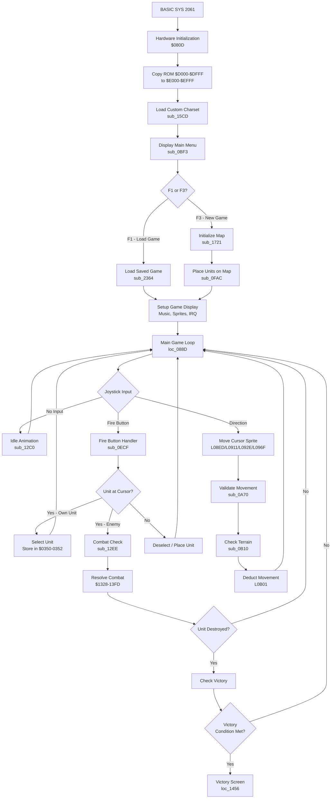
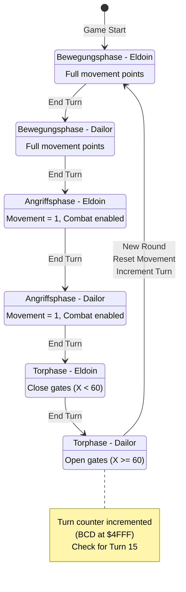
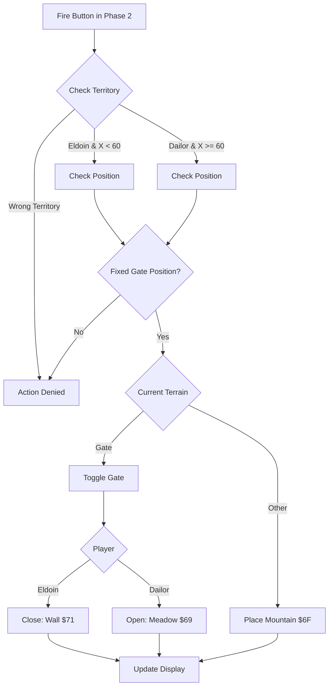

# Program Flow and Turn Structure

This document describes the program flow, turn structure, and state machine of Weltendämmerung.

## High-Level Program Flow

## Turn Structure State Machine

The game uses a 6-state turn system controlled by two variables:
- `$034A` - GAME_STATE (phase: 0, 1, or 2)
- `$0347` - CURRENT_PLAYER (0 = Eldoin, 1 = Dailor)

Combined state = `(GAME_STATE * 2) + CURRENT_PLAYER + 1`

### The Three Phases (German names from game text)

1. **Bewegungsphase** (Movement Phase) - Phase 0
   - Full movement points available
   - Units can move and reposition

2. **Angriffsphase** (Attack Phase) - Phase 1
   - Movement restricted to 1 point per unit
   - Combat actions enabled

3. **Torphase** (Gate Phase) - Phase 2
   - Players can toggle gates at 13 fixed positions on the map
   - Eldoin (X < 60): Closes gates → Wall ($71)
   - Dailor (X >= 60): Opens gates → Meadow ($69)
   - 10 gate positions in Eldoin's territory, 3 in Dailor's

## Turn Phase Details

### State Transitions (loc_1EA8)

| Combined State | Phase | Player     | German Name    | Action                                  |
|----------------|-------|------------|----------------|-----------------------------------------|
| 1              | 0     | 0 (Eldoin) | Bewegungsphase | Movement phase, full points             |
| 2              | 0     | 1 (Dailor) | Bewegungsphase | Movement phase, set movement=1 for next |
| 3              | 1     | 0 (Eldoin) | Angriffsphase  | Attack phase, movement=1                |
| 4              | 1     | 1 (Dailor) | Angriffsphase  | Attack phase                            |
| 5              | 2     | 0 (Eldoin) | Torphase       | Fortification phase                     |
| 6              | 2     | 1 (Dailor) | Torphase       | End round, reset, increment turn        |

### Movement Point Reset

At the end of each round (state 6 → 1), the game:
1. Calls `sub_20C0` - Resets all units' movement points (B current = B max)
2. Calls `sub_227E` - Increments turn counter and checks for game end

### Attack Phase Restrictions

When entering states 2 or 3, `sub_20D3` sets all units' movement points to 1, limiting movement during attack phases.

### Gate Phase (Torphase) Details

Players can toggle gates at 13 fixed positions. Code at `L0F06` in `$0F06-$0FAB_torphase.asm`.

**Fixed Gate Positions:** 13 predefined locations (coordinates at $0F5D/$0F6A)
- 10 gates in Eldoin's territory (X < 60)
- 3 gates in Dailor's territory (X >= 60)

**Gate Actions:**
- Eldoin closes gates: Gate ($6F) → Wall ($71)
- Dailor opens gates: Gate ($6F) → Meadow ($69)

## Victory Conditions

*See [victory_conditions.md](victory_conditions.md) for detailed victory condition mechanics, code locations, and game balance analysis.*

| Condition           | Winner | Trigger                            |
|---------------------|--------|------------------------------------|
| Turn Limit          | Eldoin | Turn counter reaches 15            |
| Commander Destroyed | Dailor | Eldoin's Feldherr unit eliminated  |
| Army Annihilation   | Eldoin | All Dailor units destroyed         |
