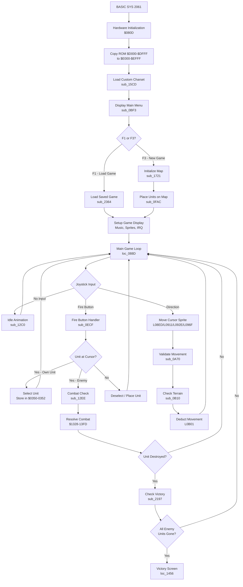
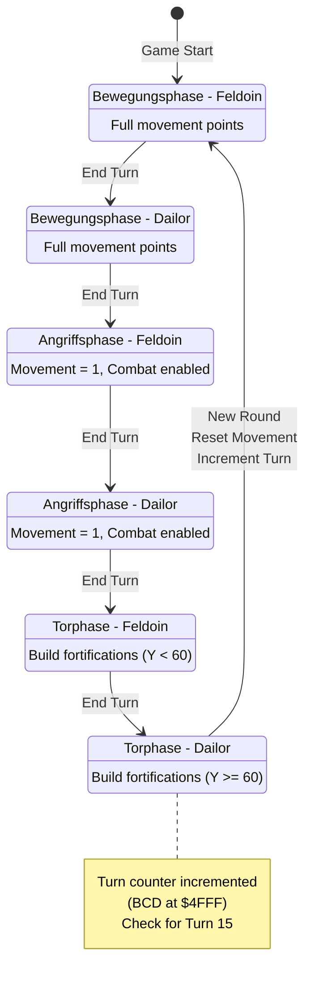
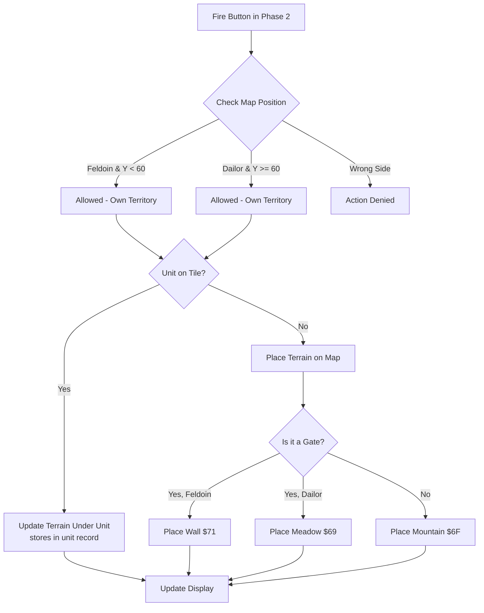

# Program Flow and Turn Structure

This document describes the program flow, turn structure, and state machine of Weltendämmerung.

## High-Level Program Flow

## Turn Structure State Machine

The game uses a 6-state turn system controlled by two variables:
- `$034A` - GAME_STATE (phase: 0, 1, or 2)
- `$0347` - CURRENT_PLAYER (0 = Feldoin, 1 = Dailor)

Combined state = `(GAME_STATE * 2) + CURRENT_PLAYER + 1`

### The Three Phases (German names from game text)

1. **Bewegungsphase** (Movement Phase) - Phase 0
   - Full movement points available
   - Units can move and reposition

2. **Angriffsphase** (Attack Phase) - Phase 1
   - Movement restricted to 1 point per unit
   - Combat actions enabled

3. **Torphase** (Gate/Fortification Phase) - Phase 2
   - Players can build fortifications on their territory
   - Feldoin (Y < 60): Can place walls ($71) or mountains ($6F)
   - Dailor (Y >= 60): Can place walls ($71) or mountains ($6F)
   - Gates ($6E) can be converted: Feldoin→Wall, Dailor→Meadow

## Turn Phase Details

### State Transitions (loc_1EA8)

| Combined State | Phase | Player | German Name | Action |
|----------------|-------|--------|-------------|--------|
| 1 | 0 | 0 (Feldoin) | Bewegungsphase | Movement phase, full points |
| 2 | 0 | 1 (Dailor) | Bewegungsphase | Movement phase, set movement=1 for next |
| 3 | 1 | 0 (Feldoin) | Angriffsphase | Attack phase, movement=1 |
| 4 | 1 | 1 (Dailor) | Angriffsphase | Attack phase |
| 5 | 2 | 0 (Feldoin) | Torphase | Fortification phase |
| 6 | 2 | 1 (Dailor) | Torphase | End round, reset, increment turn |

### Movement Point Reset

At the end of each round (state 6 → 1), the game:
1. Calls `sub_20C0` - Resets all units' movement points (B current = B max)
2. Calls `sub_227E` - Increments turn counter and checks for game end

### Attack Phase Restrictions

When entering states 2 or 3, `sub_20D3` sets all units' movement points to 1, limiting movement during attack phases.

### Fortification Phase (Torphase) Details

The Torphase (`L0ED9` in `$0E14-$0FAB_sound_sprites.asm`) allows terrain modification:

**Territory Boundary:** Y coordinate $3C (60) divides the map:
- Feldoin territory: Y < 60 (northern half)
- Dailor territory: Y >= 60 (southern half)

**Buildable Terrain:**
- Mountains ($6F / "Gebirge") - Default fortification
- Walls ($71 / "Mauer") - When building on gates (Feldoin only)
- Meadow ($69 / "Wiese") - When Dailor destroys a gate
