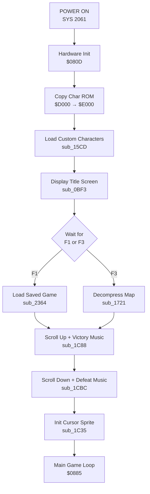

# Title Screen

The title screen is displayed on game startup before the main gameplay begins. It shows the game title, credits, and menu options.

## Display Layout

```
+----------------------------------------+
|                                        |
|      DIRK "MEIER" SCHRIEB:             |
|         WELTENDAEMMERUNG               |
|                                        |
|      (C) 1987 MARKT UND TECHNIK        |
|                                        |
|   EIN FANTASY-STRATEGIE-SPIEL          |
|      FUER ZWEI FELDHERREN              |
|                                        |
|                                        |
|      <F1> ALTES SPIEL LADEN            |
|      <F3> NEUES SPIEL STARTEN          |
|                                        |
+----------------------------------------+
```

## Startup Sequence

The title screen initialization occurs in `$080D-$0884_initialization.asm`:

| Step  | Address  | Subroutine  | Description                                                     |
|-------|----------|-------------|-----------------------------------------------------------------|
| 1     | $0816    | -           | Clear SID registers, zero page vars ($0340-$0359), state memory |
| 2     | $0819    | sub_1B22    | Bank out ROMs (access RAM at $D000-$FFFF)                       |
| 3     | $0837    | -           | Copy character ROM from $D000 to $E000                          |
| 4     | $0844    | sub_1B28    | Bank ROMs back in                                               |
| 5     | $0847    | sub_15CD    | Load custom character patterns to $E2F0                         |
| 6     | $0848    | sub_0BF3    | Initialize screen and display title menu                        |
| 7     | $0849    | sub_0E56    | Set up raster IRQ handler                                       |

## Screen Initialization (sub_0BF3)

Located at `$0BF3-$0E13_menu_text.asm`, this routine:

1. **Clear Screen** - Calls KERNAL routine `BASIC_CLRSCR`
2. **Set Colors**:
   - Border: Blue ($06)
   - Background: Black ($00)
3. **Draw Frame** - Places border characters ($61-$68) around screen edges
4. **Fill Interior** - Uses self-modifying code at $0C51 to create checkered terrain pattern:
   - Reads from BASIC header memory, masks with $01
   - Produces alternating $69/$6A (meadow tile variants)
   - Sets color to Dark Gray ($0B)
5. **Display Text** - Outputs title text from data at $0CD3

## Title Text Data

The PETSCII-encoded text at $0CD3-$0D70 contains color codes and formatting:

| Offset  | Content                       | Color            |
|---------|-------------------------------|------------------|
| +0      | "DIRK MEIER SCHRIEB:"         | Yellow ($07)     |
| +26     | "WELTENDAEMMERUNG"            | White ($01)      |
| +44     | "(C) 1987 MARKT UND TECHNIK"  | Green ($05)      |
| +72     | "EIN FANTASY-STRATEGIE-SPIEL" | Light Blue ($0E) |
| +101    | "FUER ZWEI FELDHERREN"        | Light Blue ($0E) |
| +124    | "<F1> ALTES SPIEL LADEN"      | Purple ($04)     |
| +148    | "<F3> NEUES SPIEL STARTEN"    | Purple ($04)     |

**Format Characters:**
- `$5C` = Line break (carriage return)
- `$97` = Reverse video on
- `$A9` = Space (reverse video)
- `$9E`, `$9A`, `$9C`, `$1E` = Color control codes

## Menu Input Handling

At $0CBB, the routine polls for keyboard input:

```
L0CBB:  JSR GETIN           ; Read keyboard
        CMP #$86            ; F3 key?
        BEQ loc_0CCF        ; Yes: new game
        CMP #$85            ; F1 key?
        BNE L0CBB           ; No: keep polling
        STA $035D           ; Store menu selection
        JSR sub_2364        ; Load saved game
```

| Key | Code | Action | Next Step |
|-----|------|--------|-----------|
| F1 | $85 | Load saved game | Calls sub_2364 (disk I/O) |
| F3 | $86 | Start new game | Proceeds to game init |

The menu selection is stored in `MENU_SELECT` ($035D).

## Animation Sequence

After menu selection, the initialization continues with a dramatic reveal:

### Victory Music + Scroll Up (sub_1C88 at $1C88)

```
sub_1C88:
        JSR sub_0E14        ; Initialize SID
        LDA #$F7
        STA SID_RESFLT      ; Set filter resonance
        LDX #$13            ; 19 iterations

L1C97:  TXA
        PHA
        JSR sub_1AB4        ; Scroll screen up one row
        PLA
        TAX
        ASL A               ; X * 8
        ASL A
        ASL A
        STA SID_FCUTH       ; Ascending filter cutoff
        STA SID_V1FREQH     ; Ascending pitch
        STA SID_V2FREQH
        STA SID_V3FREQH
        LDY #$19
        JSR sub_1CF3        ; Delay
        DEX
        BNE L1C97
```

**Effect**: Screen scrolls up 19 rows while playing ascending tones.

### Defeat Music + Scroll Down (sub_1CBC at $1CBC)

```
sub_1CBC:
        JSR sub_0E14        ; Initialize SID
        LDX #$13            ; 19 iterations

L1CC6:  TXA
        PHA
        JSR sub_1BF0        ; Scroll screen down one row
        PLA
        TAX
        EOR #$FF            ; Invert for descending
        ASL A
        ASL A
        ASL A
        STA SID_V1FREQH     ; Descending pitch
        STA SID_V2FREQH
        STA SID_V3FREQH
        STA SID_FCUTH       ; Descending filter
        DEX
        BNE L1CC6
```

**Effect**: Screen scrolls down 19 rows while playing descending tones.

## IRQ Setup

The title screen sets up an IRQ handler at $0DAB:

```
sub_0DAB:
        SEI                 ; Disable interrupts
        LDA #$C2
        STA IRQ_VECTOR_LO   ; IRQ -> $0DC2
        LDA #$0D
        STA IRQ_VECTOR_HI
        LDA #$02
        STA $0346           ; IRQ counter
        CLI
        RTS
```

This enables smooth animation during the title display.

## Memory Usage

| Address     | Size       | Purpose                         |
|-------------|------------|---------------------------------|
| $0CD3-$0D70 | ~160 bytes | Title text data (PETSCII)       |
| $0340-$0359 | 26 bytes   | Zero page variables (cleared)   |
| $035D       | 1 byte     | Menu selection storage          |
| $C000-$C3FF | 1024 bytes | Screen memory                   |
| $D800-$DBE7 | 1000 bytes | Color RAM                       |
| $E000-$EFFF | 4096 bytes | Character set (copied from ROM) |
| $E2F0-$E408 | 280 bytes  | Custom character patterns       |

## Color Scheme

| Element          | Color Code | Color      |
|------------------|------------|------------|
| Border           | $06        | Blue       |
| Background       | $00        | Black      |
| Frame characters | $0B        | Dark Gray  |
| Interior fill    | $0B        | Dark Gray  |
| Title text       | $01        | White      |
| Credits          | $07        | Yellow     |
| Subtitle         | $0E        | Light Blue |
| Menu options     | $04        | Purple     |

## Program Flow



## Related Files

| File                               | Description                          |
|------------------------------------|--------------------------------------|
| `$080D-$0884_initialization.asm`   | Main startup sequence                |
| `$0BF3-$0E13_menu_text.asm`        | Title display, text data, menu input |
| `$0E14-$0F05_sound_sprites.asm`    | SID initialization, IRQ setup        |
| `$15CD-$1A3E_graphics_data.asm`    | Custom character loading             |
| `$1A3F-$1E8A_utilities_render.asm` | Scroll routines, music sequences     |
| `$2307-$23D7_file_io.asm`          | Load game routine (sub_2364)         |