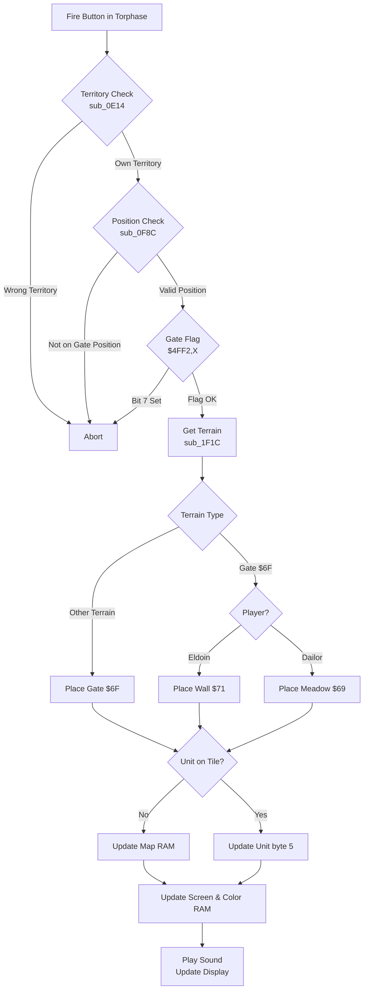

# Weltendaemmerung Torphase (Gate Phase)

This document describes the Torphase mechanics, gate positions, and fortification system.

## Overview

The Torphase (Gate Phase) is Phase 2 of each round. During this phase, players can modify terrain at 13 fixed gate positions on the map. Unlike movement and combat which work on any tile, torphase actions are restricted to predetermined strategic locations.

**Phase Behavior:**

| Phase | Name                      | Movement Points  | Combat    | Torphase |
|-------|---------------------------|------------------|-----------|----------|
| 0     | Bewegungsphase (Movement) | Full B value     | Disabled  | Disabled |
| 1     | Angriffsphase (Attack)    | Restricted to 1  | Enabled   | Disabled |
| 2     | Torphase (Fortification)  | No movement      | Disabled  | Enabled  |

## Gate Mechanics

### Asymmetric Gate Conversion

When acting on a Gate ($6F), each player **replaces** it with different terrain:

| Player | Gate ($6F) becomes   | Result Terrain    | Strategic Effect  |
|--------|----------------------|-------------------|-------------------|
| Eldoin | Wall                 | $71 (Mauer)       | Creates barrier   |
| Dailor | Meadow               | $69 (Wiese)       | Creates open terrain |

Note: The gate is permanently replaced - this is not a toggle operation.

### Gate Placement on Non-Gate Terrain

When the cursor is on any terrain **other than a gate**, both players place a new Gate ($6F/Tor) regardless of which player is active. This overwrites the existing terrain.

### Unit Handling

If a unit occupies the target tile:
1. The terrain code stored in the unit's record (byte [5]) is checked
2. The new terrain is written to unit[5] instead of the map
3. When the unit moves or dies, the updated terrain is revealed

**Confirmed Bug:** When torphase modifies terrain under a unit, only `unit[5]` is updated. However, the movement system uses a separate global variable `STORED_CHAR ($0352)` to restore terrain when units move away - and this is NOT updated by torphase.

**Bug Scenario:**
1. Unit moves onto gate → `STORED_CHAR = $6F`, `unit[5] = $6F`
2. Torphase converts gate → `unit[5] = $71 (wall)`, but `STORED_CHAR` still = `$6F`
3. Unit moves away → terrain restored from `STORED_CHAR` (gate $6F)
4. **Result: The torphase change is lost!**

| Variable | After Torphase | Used For |
|----------|----------------|----------|
| Map data ($5000+) | Gate ($6F) | Scrolling, save/load |
| `unit[5]` | Wall ($71) | Not used for restore! |
| `STORED_CHAR ($0352)` | Gate ($6F) | **Restoring map when unit moves** |

**Impact:** Any torphase action on an occupied gate position is effectively ignored. The terrain change is lost when the unit moves away.

**Workaround:** Don't perform torphase on gate positions occupied by units - move the unit away first.

## Territory Restrictions

The map is divided into two territories with a boundary at **X = 60 ($3C)**:

| Territory | Player | X Range  | Allowed Action |
|-----------|--------|----------|----------------|
| Western   | Eldoin | X < 60   | Build/modify   |
| Eastern   | Dailor | X >= 60  | Build/modify   |

Players can **only** perform torphase actions in their own territory.

## Gate Positions

There are **13 fixed gate positions** on the map. The cursor must be on one of these positions for torphase actions to work.

### Position Table

| Index | X (hex) | Y (hex) | X (dec) | Y (dec) | Territory |
|-------|---------|---------|---------|---------|-----------|
| 0     | $05     | $06     | 5       | 6       | Eldoin    |
| 1     | $11     | $05     | 17      | 5       | Eldoin    |
| 2     | $1D     | $0A     | 29      | 10      | Eldoin    |
| 3     | $0E     | $15     | 14      | 21      | Eldoin    |
| 4     | $2A     | $15     | 42      | 21      | Eldoin    |
| 5     | $2F     | $15     | 47      | 21      | Eldoin    |
| 6     | $34     | $15     | 52      | 21      | Eldoin    |
| 7     | $19     | $19     | 25      | 25      | Eldoin    |
| 8     | $05     | $23     | 5       | 35      | Eldoin    |
| 9     | $0B     | $22     | 11      | 34      | Eldoin    |
| 10    | $46     | $07     | 70      | 7       | Dailor    |
| 11    | $45     | $11     | 69      | 17      | Dailor    |
| 12    | $4B     | $22     | 75      | 34      | Dailor    |

**Distribution:** 10 gates in Eldoin territory, 3 gates in Dailor territory.

### Coordinate Storage

Gate coordinates are stored at fixed addresses:
- **X coordinates**: $0F5D (13 bytes)
- **Y coordinates**: $0F6A (13 bytes)

## Validation Process

### Position Check (sub_0F8C)

Before any torphase action executes, the cursor position is validated:

```assembly
sub_0F8C:
    LDX #$0C                ; Check 13 positions (0-12)
L0F8E:
    LDA $034B               ; CURSOR_MAP_X
    CMP $0F5D,X             ; Compare with gate X table
    BNE L0F9E               ; No match, try next
    LDA $034C               ; CURSOR_MAP_Y
    CMP $0F6A,X             ; Compare with gate Y table
    BEQ L0FA1               ; Match found
L0F9E:
    DEX
    BPL L0F8E               ; Loop through all positions
L0FA1:
    BMI L0FA9               ; No match: abort
    LDA $4FF2,X             ; Check gate flag
    BMI L0FA9               ; Negative: gate disabled
    RTS                     ; Valid: continue
L0FA9:
    PLA                     ; Pop return address
    PLA                     ; (abort torphase action)
    RTS
```

### Gate Flags ($4FF2)

Each gate position has a flag byte at `$4FF2,X`. If bit 7 is set (negative), the torphase action is blocked.

**How gates become blocked:**

1. All gate flags are initialized to `$00` at game start
2. When a structure-attacking unit (Katapult, Lindwurm, Adler, Rammbock) destroys a gate in combat, the flag is **decremented**
3. `$00 - 1 = $FF` (8-bit wraparound)
4. `$FF` has bit 7 set, so `BMI` triggers and blocks torphase at that position

**Important:** Once a gate has been destroyed in combat, that position is **permanently disabled** for torphase actions. Players cannot rebuild at that location.

This creates strategic depth: protecting gates from siege units (Katapult, Lindwurm) is critical, because losing a gate to combat means losing that fortification point forever.

## Flow Diagram



## Terrain Codes

| Code | German   | English  | Movement Cost |
|------|----------|----------|---------------|
| $69  | Wiese    | Meadow   | 1             |
| $70  | Gebirge  | Mountains| 1             |
| $71  | Mauer    | Wall     | 1             |
| $6F  | Tor      | Gate     | 1             |

## Key Memory Addresses

### Variables

| Address     | Name             | Description                          |
|-------------|------------------|--------------------------------------|
| $0347       | CURRENT_PLAYER   | Active player (0=Eldoin, 1=Dailor)   |
| $034A       | GAME_STATE       | Current phase (0, 1, 2)              |
| $034B       | CURSOR_MAP_X     | Cursor X position                    |
| $034C       | CURSOR_MAP_Y     | Cursor Y position                    |
| $034E       | UNIT_TYPE_IDX    | Temporary: unit type if on tile      |
| $4FF2       | STATE_GATE_FLAGS | Gate enable/disable flags (13 bytes) |

### Data Tables

| Address | Size | Description               |
|---------|------|---------------------------|
| $0F5D   | 13   | Gate X coordinates        |
| $0F6A   | 13   | Gate Y coordinates        |
| $4FF2   | 13   | Gate flags (one per gate) |

### Routines

| Address | Name     | Purpose                                    |
|---------|----------|--------------------------------------------|
| $0F06   | L0F06    | Main torphase action handler               |
| $0F4E   | L0F4E    | Gate conversion (player-specific)          |
| $0F77   | L0F77    | Update terrain in unit record              |
| $0F82   | sub_0F82 | Calculate map position from coordinates    |
| $0F8C   | sub_0F8C | Validate cursor on allowed gate position   |
| $1F1C   | sub_1F1C | Get terrain/unit at cursor                 |
| $1F77   | sub_1F77 | Get screen position for cursor             |
| $1F82   | sub_1F82 | Play sound and update display              |
| $1FF6   | sub_1FF6 | Find unit record at cursor                 |
| $1C01   | sub_1C01 | Get color for terrain type                 |
| $1EE2   | sub_1EE2 | Update terrain info display                |

## Strategic Considerations

### Asymmetric Design

The torphase reflects the asymmetric nature of the game:
- **Eldoin** (defender) converts gates to walls, creating barriers that hinder enemy movement
- **Dailor** (attacker) converts gates to meadows, creating open terrain for their forces

### Gate Distribution

With 10 gates in Eldoin's territory vs 3 in Dailor's, Eldoin has more fortification options in their homeland. This compensates for their defensive win condition (survive 15 turns).

### Gate Placement

The ability to place new gates on non-gate terrain allows players to set up future fortification opportunities at the 13 fixed positions.

### Protecting Gates

Gates destroyed in combat (by Katapult, Lindwurm, Adler, or Rammbock) are permanently lost as fortification points. This makes gate defense strategically important - siege units should be intercepted before they can destroy critical gates.
