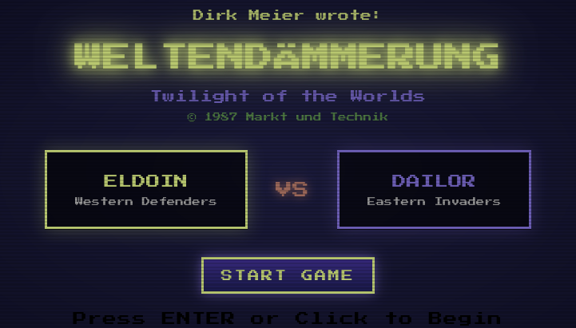
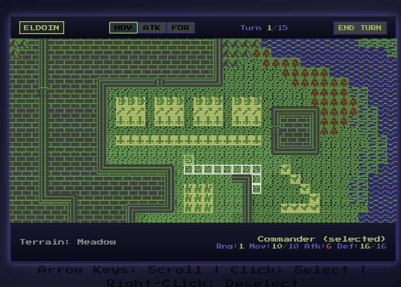
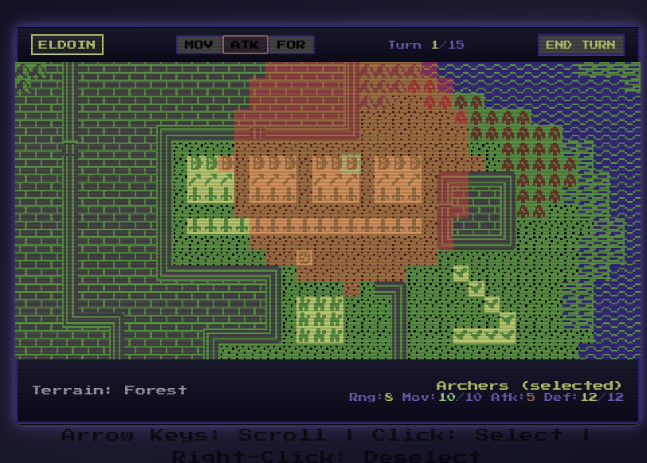
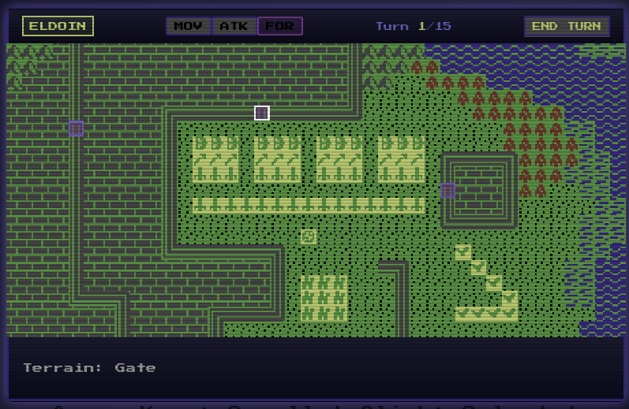

# Weltendaemmerung - Game Manual

**A Fantasy Strategy Game for Two Commanders**

---

## Introduction

Weltendaemmerung (Twilight of the Worlds) is a turn-based fantasy strategy game for two players. Each player takes the role of a commander leading their army in the mythical land of Thainfal.

**Players:**
- **Eldoin** - Commands the western forces (yellow units)
- **Dailor** - Commands the eastern forces (dark units)

---

## Getting Started

Click **START GAME** or press **Enter** to begin.

### Controls

- **Arrow Keys** - Scroll the map
- **Click** - Select units
- **Right-Click** - Deselect
- **END TURN** button - Advance to next phase

---

## Turn Structure

The game alternates between players in three phases per round:

| Phase   | Description                       |
|---------|-----------------------------------|
| **MOV** | Movement Phase - move your units  |
| **ATK** | Attack Phase - engage in combat   |
| **FOR** | Fortification Phase - build gates |

Each player completes all three phases before the round ends. Eldoin always moves first.

---

## Movement Phase (MOV)

*The game map showing Eldoin's turn during movement phase*

During this phase, you can move your units across the map.

### How to Move

1. Click on one of your units to select it
2. Click on an adjacent tile to move
3. Movement costs points based on terrain

### Movement Points

Each unit has a maximum movement value. Moving costs points:

| Terrain   | Cost                 |
|-----------|----------------------|
| Meadow    | 1                    |
| Pavement  | 1                    |
| River     | 1-5 (varies by unit) |
| Forest    | 1-7 (varies by unit) |
| Swamp     | 1-7 (varies by unit) |
| Mountains | Blocked              |
| Gate      | Blocked              |
| Wall      | Blocked              |

**Special Units:**
- **Flying units** (Eagle, Bloodsucker) can cross any terrain for 1 point
- **Warships** can only move on rivers

Movement is **orthogonal only** - you cannot move diagonally.

---

## Attack Phase (ATK)

*Combat during the attack phase*

During this phase, you can attack enemy units.

### How to Attack

1. Click on one of your units to select it as the attacker
2. Click on an enemy unit within range to attack

### Range

Attacks can be made in **any direction**, including diagonally. Each unit has a range value that determines how far they can attack.

| Range | What it Means                            |
|-------|------------------------------------------|
| 1     | Adjacent tiles only (melee)              |
| 2-3   | Short range (can hit diagonal neighbors) |
| 5-8   | Medium range                             |
| 12    | Long range (Catapult only)               |

### Damage

Damage is calculated as: **Attack Value + Random Modifier (0-4)**

The target's defense is reduced by the damage dealt. When defense reaches 0, the unit is destroyed.

### One Attack Per Unit

Each unit can only attack **once per attack phase**.

---

## Fortification Phase (FOR)

*Building gates during the fortification phase*

During this phase, you can modify gates at fixed positions on the map.

### Building Gates

1. Click on a valid gate position
2. A gate will be opened or closed

### Strategic Note

Gates destroyed in combat by siege units cannot be rebuilt at that location.

---

## Victory Conditions

The game can end in three ways:

| Condition                        | Winner | Strategy           |
|----------------------------------|--------|--------------------|
| **Turn 15 reached**              | Eldoin | Survive and defend |
| **Eldoin's Commander destroyed** | Dailor | Hunt the Commander |
| **All Dailor units destroyed**   | Eldoin | Total war          |

**Key Insight:** Eldoin wins by surviving; Dailor must strike decisively before turn 15.

---

### Unit Statistics

| Stat    | Meaning                  |
|---------|--------------------------|
| **Rng** | Attack range in tiles    |
| **Mov** | Movement points per turn |
| **Atk** | Base attack damage       |
| **Def** | Defense/health points    |

---

## Terrain Reference

| Terrain   | Color       | Notes                           |
|-----------|-------------|---------------------------------|
| Meadow    | Green/Black | Standard terrain                |
| River     | Blue        | Slows most units; Warships only |
| Forest    | Red/Green   | Slows movement                  |
| Swamp     | Blue        | Difficult terrain               |
| Mountains | Gray        | Impassable (except flying)      |
| Pavement  | Gray        | Roads, fast travel              |
| Gate      | Gray        | Fortification point             |
| Wall      | Gray        | Impassable barrier              |

---

## Strategic Tips

### For Eldoin (Defender)

1. **Protect your Commander** - Losing the Commander means instant defeat
2. **Use terrain** - Mountains and walls funnel enemy movement
3. **Play defensively** - You win at turn 15 if you survive
4. **Guard the gates** - Use fortification phase to control chokepoints

### For Dailor (Attacker)

1. **Hunt the Commander** - Your fastest path to victory
2. **Use siege units** - Catapult, Dragon, and Battering Ram destroy fortifications
3. **Strike fast** - You must win before turn 15
4. **Leverage numbers** - You have more units; use them aggressively

---

## Status Display

The screen shows:

- **Current player** (ELDOIN or DAILOR)
- **Phase indicators** (MOV / ATK / FOR) - active phase is highlighted
- **Turn counter** showing current turn out of 15
- **Terrain type** at cursor position
- **Unit statistics** when a unit is selected: `Rng: Mov: Atk: Def:`

---

*Victory awaits the Lords of Thainfal!*
